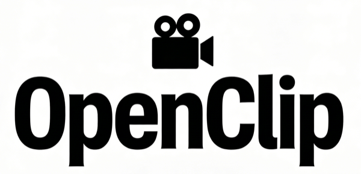

<p align="center">
  
</p>


English | [简体中文](./README.md)

A lightweight automated video processing pipeline that identifies and extracts the most engaging moments from long-form videos (especially talk-to-camera and livestream recordings). Uses AI-powered analysis to find highlights, generates clips, and adds titles and covers.

## 🎯 What It Does

Give it a video URL or local file, and it handles the full pipeline: **Download → Transcribe → Split → AI Analysis → Clip Generation → Titles and Covers** — outputting the most engaging moments. Great for quickly extracting highlights from long livestreams or videos.

> 💡 **How is it different from AutoClip?** See the [comparison section](#-comparison-with-autoclip) to learn about OpenClip's lightweight design philosophy.

## 📢 News

- **2026-03-08**:
  - Added `--user-intent` argument — tell the AI what you're looking for in natural language (e.g. `--user-intent "moments about AI risks"`); steers clip selection and ranking at both the per-part and aggregation stages
- **2026-03-04**:
  - **Git History Notice**: A mistaken attempt to reduce GitHub repo size caused the git history to be rewritten. Sorry for the inconvenience. Existing users need to run `git fetch origin && git reset --hard origin/main` to sync with the latest history
  - Added [subtitle burning](#subtitle-burning) — use `--burn-subtitles` to hard-burn SRT subtitles into clip videos; optionally add `--subtitle-translation "Simplified Chinese"` to burn bilingual subtitles (requires ffmpeg with libass)
  - Switched OpenRouter default model from openrouter/free to stepfun/step-3.5-flash:free
- **2026-03-01**:
  - Streamlit interface now supports [background job processing and concurrent video processing](#concurrent-processing)
  - Added [speaker identification (Preview)](#speaker-identification) — use `--speaker-references` to automatically label speakers by name in transcripts for interviews, panels, and podcasts
  - Improved AI prompts to reduce timestamp format confusion (e.g., `00:01:55` vs `01:55:00`)
- **2025-02-26**:
  - Switched default Qwen model from legacy qwen-turbo to qwen3.5-flash
  - Improved AI prompts to reduce timestamp hallucination and enhance title quality

## 🎬 Demos

### Web UI Demo


### Agent Skills Demo

<video src="https://github.com/user-attachments/assets/212855d0-336c-4708-8c43-c57f3e5eecd1" controls width="600" height="450"></video>

## ✨ Features
- **Flexible Input**: Bilibili/YouTube URLs or local video files
- **Smart Transcription**: Uses platform subtitles when available, falls back to Whisper
- **Speaker Identification** (Preview): automatically identifies who is speaking and labels transcripts with real names — great for interviews, panels, debates, and podcasts
- **AI Analysis**: Identifies engaging moments based on content, interaction, and entertainment value; supports `--user-intent` to focus the AI on what you care about
- **Clip Generation**: Extracts the most engaging moments as standalone video clips, automatically generating subtitle files, titles, and cover images
- **Subtitle Burning** (optional): Hard-burns SRT subtitles into the video frame; optionally translates to a target language via Qwen and burns both tracks as bilingual subtitles
- **Background Context**: Optionally add background information (e.g., streamer names) for better analysis
- **Triple Interface Support**: Streamlit web interface, Agent Skills, and command-line interface for different user needs
- **Agent Skills**: Built-in [Claude Code](https://docs.anthropic.com/en/docs/claude-code) and [TRAE](https://www.trae.ai/) agent skills for processing videos with natural language

## 📋 Prerequisites

### Manual Installation

- **uv** (Python package manager) - [Installation guide](https://docs.astral.sh/uv/getting-started/installation/)
- **FFmpeg** - For video processing
  - macOS: `brew install ffmpeg`
  - Ubuntu: `sudo apt install ffmpeg`
  - Windows: Download from [ffmpeg.org](https://ffmpeg.org)

  <details>
  <summary>Need bilingual subtitle burning? Click for libass-enabled install instructions</summary>

  The default installs above do not include libass:
  - macOS: `brew tap homebrew-ffmpeg/ffmpeg && brew install homebrew-ffmpeg/ffmpeg/ffmpeg` (replaces existing ffmpeg)
  - Ubuntu: `sudo add-apt-repository ppa:savoury1/ffmpeg4 && sudo apt install ffmpeg`
  - Windows: Download the **full** build from [gyan.dev](https://www.gyan.dev/ffmpeg/builds/)
  </details>

- **LLM API Key** (choose one)
  - **Qwen API Key** - Get your key from [Alibaba Cloud](https://dashscope.aliyun.com/) (uses qwen3.5-flash model by default)
  - **OpenRouter API Key** - Get your key from [OpenRouter](https://openrouter.ai/) (uses stepfun/step-3.5-flash:free model by default)

- **Firefox Browser** (optional) - For more stable Bilibili video downloads
- **HuggingFace Token** (optional, for speaker identification) - Get from [huggingface.co/settings/tokens](https://huggingface.co/settings/tokens) and accept the [pyannote model agreement](https://huggingface.co/pyannote/speaker-diarization-community-1)

### Managed by uv

The following are installed automatically when you run `uv sync`:

- **Python 3.11+** - Downloaded by uv if not already available
- **yt-dlp** - For downloading videos from Bilibili, YouTube, etc.
- **Whisper** - For speech-to-text transcription
- Other Python dependencies (moviepy, streamlit, etc.)

## 🚀 Quick Start

### 1. Clone and Setup

```bash
# Clone the repository
git clone https://github.com/linzzzzzz/openclip.git
cd openclip

# Install dependencies with uv
uv sync
```

### 2. Set API Key (for AI features)

**Using Qwen:**
```bash
export QWEN_API_KEY=your_api_key_here
```

**Using OpenRouter:**
```bash
export OPENROUTER_API_KEY=your_api_key_here
```

### 3. Run the Pipeline

#### Option A: Using Streamlit Web Interface

**Start Streamlit app:**
```bash
uv run python -m streamlit run streamlit_app.py
```

Once the app starts, open your browser and visit the displayed URL (typically `http://localhost:8501`).

**Usage Flow:**
1. Select input type (Video URL or Local File) in the sidebar
2. Configure processing options (LLM provider, etc.)
3. Click "Process Video" button to start processing
4. View real-time progress and final results
5. Preview generated clips and covers in the results section

**Advantages:** No need to remember command-line parameters, provides visual operation interface, suitable for all users.

<a id="concurrent-processing"></a>
<details>
<summary>🔄 Concurrent Processing & Background Jobs</summary>

The Streamlit interface supports background job processing and concurrent video processing:

**Background Job Processing:**
- Video processing runs in the background, you can close the browser
- Jobs are persisted, reopen the page to continue viewing
- Each job runs independently without interference

**Concurrent Video Processing:**
- Click "Process Video" to start the first job → automatically tracked
- **Open a new tab** to start the second job → independently tracked in the new tab
- Each tab can track different jobs independently

**Watch Progress Feature:**
- Click "👁️ Watch Progress" button on job cards to switch tracking
- "✓ Watching" indicator shows which job is currently being tracked
- Real-time progress updates and current processing step

**Job Management:**
- View all job statuses (processing, completed, failed)
- Cancel running jobs
- Delete completed or failed jobs
- View job details (creation time, processing duration, etc.)

</details>

#### Option B: Using AI Agent Skills

If you use [Claude Code](https://docs.anthropic.com/en/docs/claude-code) or [TRAE](https://www.trae.ai/), you can process videos using natural language without manually typing commands:

```
"Extract highlights from this video: https://www.bilibili.com/video/BV1234567890"
"Process ~/Downloads/livestream.mp4 with English as output language"
```

The agent automatically invokes the built-in skill to handle the full pipeline: downloading, transcription, analysis, clip generation, and title styling.

Skill definitions are located in `.claude/skills/` and `.trae/skills/`.

#### Option C: Using Command Line Interface

```bash
# Process a Bilibili video
uv run python video_orchestrator.py "https://www.bilibili.com/video/BV1234567890"

# Process a YouTube video
uv run python video_orchestrator.py "https://www.youtube.com/watch?v=dQw4w9WgXcQ"

# Process a local video
uv run python video_orchestrator.py "/path/to/video.mp4"
```

> To use existing subtitles, place the `.srt` file in the same directory with the same filename (e.g. `video.mp4` → `video.srt`).

<a id="speaker-identification"></a>
<details>
<summary>🎙️ Speaker Identification (Optional, Preview)</summary>

> ⚠️ **Preview feature**: Speaker identification is in preview. Behavior and interface may change in future releases.
>
> 🐢 **Performance note**: Speaker diarization relies on pyannote models and can be slow on CPU (may take several minutes for longer videos). A GPU environment will significantly speed this up.

For interviews, panels, debates, podcasts, and any multi-speaker video. When enabled, each line in the transcript is prefixed with the speaker's name, e.g. `[Host] Welcome to today's show`. This gives the AI richer context during highlight analysis — making it better at identifying the most engaging exchanges between specific speakers, rather than treating all speech as undifferentiated.

**Step 1: Install extra dependencies**

```bash
uv sync --extra speakers
```

**Step 2: Set your HuggingFace Token**

```bash
export HUGGINGFACE_TOKEN=hf_your_token_here
```

And accept the [pyannote model agreement](https://huggingface.co/pyannote/speaker-diarization-community-1) on HuggingFace.

**Step 3: Extract reference audio**

Cut a short clip of each speaker from your video (10–30 seconds, single speaker, clean audio):

```bash
uv run python tools/extract_reference.py VIDEO START END "references/Name.wav"

# Examples
uv run python tools/extract_reference.py interview.mp4 00:01:23 00:01:50 "references/Host.wav"
uv run python tools/extract_reference.py interview.mp4 00:03:10 00:03:40 "references/Guest.wav"
```

**Step 4: Run**

```bash
uv run python video_orchestrator.py --speaker-references references/ "VIDEO_URL_OR_PATH"
```

</details>

<a id="subtitle-burning"></a>
<details>
<summary>🔤 Subtitle Burning (Optional)</summary>

Hard-burns SRT subtitle files into the video frame so subtitles are always visible regardless of the player. Supports burning the original SRT only, or translating via Qwen and burning both tracks as bilingual subtitles. Speaker tags (e.g. `[Sam Altman]`) are automatically stripped from the on-screen display.

**Prerequisite: ffmpeg must include libass** (see install instructions above)

**Burn original subtitles only:**
```bash
uv run python video_orchestrator.py --burn-subtitles "VIDEO_URL"
```

**Burn original + translated subtitles:**
```bash
uv run python video_orchestrator.py \
  --burn-subtitles \
  --subtitle-translation "Simplified Chinese" \
  "VIDEO_URL"
```

Output goes to `clips_post_processed/`. The original language appears at the bottom, the translation appears just above it.

</details>

## 📖 CLI Arguments

| Argument | Description | Default |
|----------|-------------|---------|
| `VIDEO_URL_OR_PATH` | Video URL or local file path (positional) | Required |
| `-o`, `--output` | Custom output directory | `processed_videos` |
| `--llm-provider` | LLM provider (`qwen` or `openrouter`) | `qwen` |
| `--language` | Output language (`zh` or `en`) | `zh` |
| `--browser` | Browser for cookies (`chrome`/`firefox`/`edge`/`safari`) | `firefox` |
| `--force-whisper` | Force Whisper transcription (ignore platform subtitles) | Off |
| `--use-background` | Use background info for analysis | Off |
| `--user-intent` | Natural language description of what you're looking for (e.g. `"moments about AI risks"`); steers LLM clip selection and ranking | None |
| `--max-clips` | Maximum number of highlight clips | `5` |
| `--title-style` | Title artistic style (see list below) | `fire_flame` |
| `--title-font-size` | Font size preset for artistic titles. Options: small(30px), medium(40px), large(50px), xlarge(60px) (default: medium=40px) | `medium` |
| `--cover-text-location` | Cover text position (`top`/`upper_middle`/`bottom`/`center`) | `center` |
| `--cover-fill-color` | Cover text fill color (`yellow`/`red`/`white`/`cyan`/`green`/`orange`/`pink`/`purple`/`gold`/`silver`) | `yellow` |
| `--cover-outline-color` | Cover text outline color (`yellow`/`red`/`white`/`cyan`/`green`/`orange`/`pink`/`purple`/`gold`/`silver`/`black`) | `black` |
| `--speaker-references` | Directory of reference audio clips for speaker name mapping (Preview). Filename stem becomes the speaker name (e.g. `references/Host.wav`). Requires `uv sync --extra speakers` and `HUGGINGFACE_TOKEN` | None |
| `--skip-transcript` | Skip transcript generation (use existing transcript files) | Off |
| `--skip-download` | Skip download, use existing video | Off |
| `--skip-analysis` | Skip analysis, use existing results | Off |
| `--skip-clips` | Don't generate clips | Off |
| `--add-titles` | Add artistic titles to clips | Off |
| `--skip-cover` | Don't generate cover images | Off |
| `--burn-subtitles` | Hard-burn SRT subtitles into clips, output to `clips_post_processed/` (requires ffmpeg with libass) | Off |
| `--subtitle-translation` | Translate subtitles to this language before burning (e.g. `"Simplified Chinese"`); requires `--burn-subtitles` | None |
| `-f`, `--filename` | Custom output filename template | None |
| `-v`, `--verbose` | Enable verbose logging | Off |
| `--debug` | Enable debug mode (export full LLM prompts) | Off |

<details>
<summary>🎨 Title Artistic Styles</summary>

| Style | Effect |
|-------|--------|
| `fire_flame` | Fire flame effect (default) |
| `gradient_3d` | Gradient 3D effect |
| `neon_glow` | Neon glow effect |
| `metallic_gold` | Metallic gold effect |
| `rainbow_3d` | Rainbow 3D effect |
| `crystal_ice` | Crystal ice effect |
| `metallic_silver` | Metallic silver effect |
| `glowing_plasma` | Glowing plasma effect |
| `stone_carved` | Stone carved effect |
| `glass_transparent` | Glass transparent effect |

</details>

## 🔍 Command Line Examples

**Process a Bilibili video with background info and neon glow style title:**
```bash
uv run python video_orchestrator.py \
  --title-style neon_glow \
  --use-background \
  "https://www.bilibili.com/video/BV1wT6GBBEPp"
```

**Analysis only, no clip generation:**
```bash
uv run python video_orchestrator.py --skip-clips "VIDEO_URL"
```

**Speaker identification (Preview):**
```bash
uv run python video_orchestrator.py \
  --speaker-references references/ \
  "interview.mp4"
```

**Skip download, reprocess existing video:**
```bash
uv run python video_orchestrator.py --skip-download --title-style crystal_ice "VIDEO_URL"
```

## 📁 Output Structure

After processing, the output directory is structured as follows:

```
processed_videos/{video_name}/
├── downloads/                # Original video, subtitles, and metadata
├── splits/                   # Split parts and AI analysis results
├── clips/                    # Generated highlight clips, subtitles, summary, and cover images
│   ├── rank_01_xxx.mp4
│   ├── rank_01_xxx.srt
│   ├── engaging_moments_summary.md
│   └── cover_rank_01_xxx.jpg
└── clips_post_processed/     # Post-processed clips (--add-titles and/or --burn-subtitles)
    ├── rank_01_xxx.mp4
    └── ...
```

## 🎨 Customization

### Adding Background Information

Create or edit `prompts/background/background.md` to provide context about streamers, nicknames, or recurring themes:

```markdown
# Background Information

## Streamer Information
- Main streamer: 旭旭宝宝 (Xu Xu Bao Bao)
- Nickname: 宝哥 (Bao Ge)
- Game: Dungeon Fighter Online (DNF)

## Common Terms
- 增幅: Equipment enhancement
- 鉴定: Item appraisal
```

Then use the `--use-background` flag:
```bash
uv run python video_orchestrator.py --use-background "VIDEO_URL"
```

### Customizing Analysis Prompts

Edit prompt templates in `prompts/`:
- `engaging_moments_part_requirement.md` - Analysis criteria for each part
- `engaging_moments_agg_requirement.md` - Aggregation criteria for top moments

## 📎 Others

<details>
<summary>🔧 Workflow</summary>

```
Input (URL or File)
    ↓
Download/Validate Video
    ↓
Extract/Generate Transcript
    ↓
Check Duration → Split if >20 min
    ↓
AI Analysis (per part)
    ↓
Aggregate Top 5 Moments
    ↓
Generate Clips
    ↓
Post-processing (optional)
  ├── Add Artistic Titles (--add-titles)
  └── Burn Subtitles (--burn-subtitles [--subtitle-translation LANG])
    ↓
Generate Cover Images
    ↓
Output Ready!
```

</details>

<details>
<summary>🐛 Troubleshooting</summary>

### Download fails
**Cause**: 
- yt-dlp version is too old. Try updating dependencies: `uv sync`.
- Cookie/authentication issues. Try `--browser firefox` to switch browsers, or login to Bilibili in your browser first.

### No clips generated
**Cause**: Missing API key or analysis failed. Check `echo $QWEN_API_KEY` or `echo $OPENROUTER_API_KEY`, and verify analysis files exist.

### FFmpeg errors
**Cause**: FFmpeg not installed or not in PATH. Run `ffmpeg -version` to check, install if missing (macOS: `brew install ffmpeg`).

### Memory issues
**Cause**: Very long video. Try `--max-duration 10` for shorter splits, or process without `--add-titles` to reduce memory usage.

### Speaker identification not working

**WhisperX not found**: Run `uv sync --extra speakers` to install the extra dependencies.

**HuggingFace Token error**: Check `echo $HUGGINGFACE_TOKEN` is set, and confirm you have accepted the [pyannote model agreement](https://huggingface.co/pyannote/speaker-diarization-community-1) on HuggingFace.

**Speakers not matched (showing SPEAKER_XX instead of names)**: The reference audio similarity is below the threshold (default 0.7). Try a longer, cleaner reference clip (10–30 seconds recommended) with only one speaker throughout.

### Chinese text not displaying
**Cause**: Missing Chinese fonts. macOS auto-detects (STHeiti, PingFang), Windows needs SimSun or Microsoft YaHei, Linux needs `fonts-wqy-zenhei`.

</details>

## 🔄 Comparison with AutoClip

OpenClip is inspired by [AutoClip](https://github.com/zhouxiaoka/autoclip) but takes a different approach:

| Feature | OpenClip | AutoClip |
|---------|----------|----------|
| **Code Size** | ~5K lines | ~2M lines (with frontend deps) |
| **Dependencies** | Python + FFmpeg | Docker + Redis + PostgreSQL + Celery |
| **Customization** | Editable prompt templates | Configuration files |
| **Interface** | Web UI + Agent Skills + Command-line | Web UI |
| **Deployment** | `uv sync` and go | Docker containerized |

**OpenClip Features:** Lightweight (5K lines), fast startup, customizable prompts, 10 title styles, easy to maintain and extend

Thanks to [AutoClip](https://github.com/zhouxiaoka/autoclip) for their contributions to video automation.

## 🤝 Contributing

PRs welcome! We aim to keep the codebase lightweight and readable:

**Areas for improvement**
- Improved AI analysis prompts
- Performance optimizations
- Multimodal analysis
- Support for more video platforms
- Additional language support

## 📞 Support

For issues or questions:
1. Review error messages in console output
2. Test with a short video first
3. Open an issue on GitHub
4. Join our [Discord community](https://discord.gg/KsC4Keaq) for discussions

## ⭐ Enjoying OpenClip?

If this project has been helpful to you, please consider giving us a Star on GitHub! ⭐

Your support motivates us to keep improving!

## 📄 License

This project is licensed under the MIT License - see the [LICENSE](LICENSE) file for details
